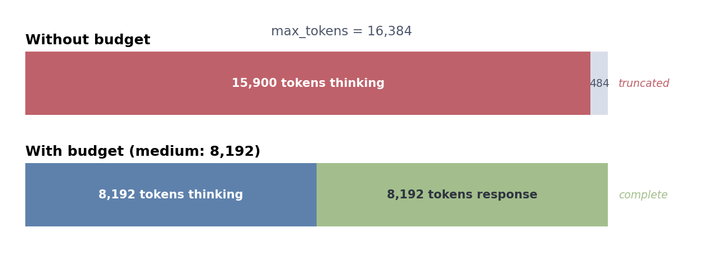
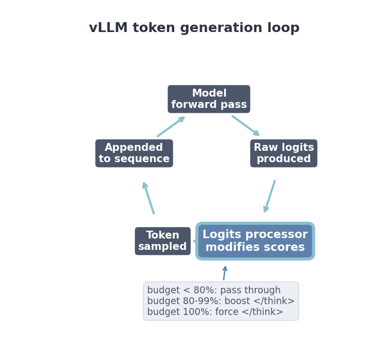
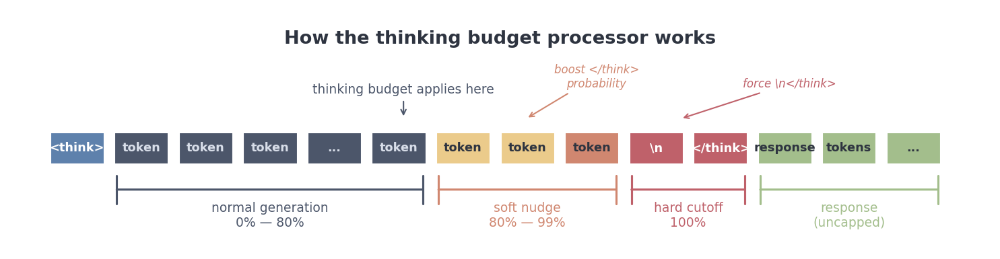

# vllm-thinking-budget

Cap thinking tokens on vLLM to stop reasoning models from burning your entire output budget.

## The problem

Reasoning models (Qwen 3.5, QwQ, DeepSeek-R1, etc.) generate `<think>...</think>` blocks before producing a response. Without limits, they routinely spend 90%+ of your `max_tokens` budget on internal reasoning. Ask the model to say hello and you get 500 tokens of deliberation about greetings before the actual answer. vLLM has no built-in mechanism to control this.

Thinking tokens count against `max_tokens`. Set `max_tokens` to 16,384 and the model thinks for 16,000 tokens — you get 384 tokens of actual response, often truncated mid-sentence. Worse, if thinking consumes the entire budget, you get an empty response: just a `</think>` tag and nothing else.



This breaks any client that expects structured output. Claude Code, for example, relies on the model returning complete tool calls and JSON. When thinking eats the token budget, Claude Code gets empty or truncated responses and the session fails — tool calls don't parse, edits don't apply, the agent stalls. The same applies to any tool-calling or function-calling workflow.

## Quick start

1. Clone this repo and add it to your `PYTHONPATH`:

```bash
git clone https://github.com/phishingupstream/vllm-thinking-budget.git
export PYTHONPATH=/path/to/vllm-thinking-budget:$PYTHONPATH
```

2. Add the processor to your vLLM model config YAML:

```yaml
logits-processors:
  - "thinking_budget_processor:ThinkingBudgetLogitsProcessor"
```

3. Restart vLLM. You should see this in the logs:

```
ThinkingBudgetLogitsProcessor initialized: think_start=..., think_end=..., nl=..., model=...
```

Every request with a thinking budget will log:
```
Tracking request at index 0: budget=8192, starts_in_thinking=True
```

## How it works

The processor hooks into vLLM's token generation loop, modifying logits before each token is sampled:



It tracks `<think>` and `</think>` token IDs per request, counting tokens spent inside thinking blocks. At 80% of the budget it applies a soft nudge, boosting the probability of the `</think>` token to encourage the model to wrap up. At 100% it forces a hard cutoff by emitting `\n</think>`. The budget is cumulative across re-opened thinking blocks within the same request.



## Client usage

The simplest way to set a thinking budget requires no patches — pass it directly via `vllm_xargs`:

```python
response = client.chat.completions.create(
    model="your-model",
    messages=[{"role": "user", "content": "Hello"}],
    extra_body={"vllm_xargs": {"max_thinking_tokens": 4096}},
)
```

### With patches installed

The optional [patches](#the-patches-optional) add cleaner APIs. Once applied:

**OpenAI-compatible endpoint** — use `reasoning_effort`:

```python
response = client.chat.completions.create(
    model="your-model",
    messages=[{"role": "user", "content": "Hello"}],
    extra_body={"reasoning_effort": "medium"},
)
```

**Anthropic `/v1/messages` endpoint** — use `thinking`:

```python
response = client.messages.create(
    model="your-model",
    messages=[{"role": "user", "content": "Hello"}],
    max_tokens=8192,
    thinking={"type": "enabled", "budget_tokens": 4096},
)
```

### Effort-to-budget mapping

| `reasoning_effort` | `enable_thinking` | `max_thinking_tokens` |
|---------------------|-------------------|-----------------------|
| `none`              | `false`           | ---                   |
| `low`               | `true`            | 2,048                 |
| `medium` (default)  | `true`            | 8,192                 |
| `high`              | `true`            | unlimited             |

## The patches (optional)

The processor works without any patches — clients can always use `vllm_xargs` directly. The patches add friendlier APIs on top:

- **`patches/fix_enable_thinking_compat.py`** — Adds `reasoning_effort` and `enable_thinking` fields to the OpenAI-compatible chat completions endpoint, translating them into `max_thinking_tokens` for the processor.
- **`patches/fix_anthropic_thinking_compat.py`** — Adds `thinking` configuration support to the Anthropic `/v1/messages` endpoint, mapping `budget_tokens` to `max_thinking_tokens`.

Each patch is a standalone Python script that modifies vLLM's installed source files. Run them once after installing vLLM:

```bash
python patches/fix_enable_thinking_compat.py
python patches/fix_anthropic_thinking_compat.py
```

They are idempotent — safe to re-run.

## Compatibility

- vLLM v0.17+ (V1 engine)
- Tested with Qwen 3.5 35B-A3B (NVFP4)
- Should work with any model that uses `<think>`/`</think>` tokens (QwQ, DeepSeek-R1, etc.) but not tested

## License

[CC BY-NC 4.0](https://creativecommons.org/licenses/by-nc/4.0/) — free for non-commercial use with attribution.
